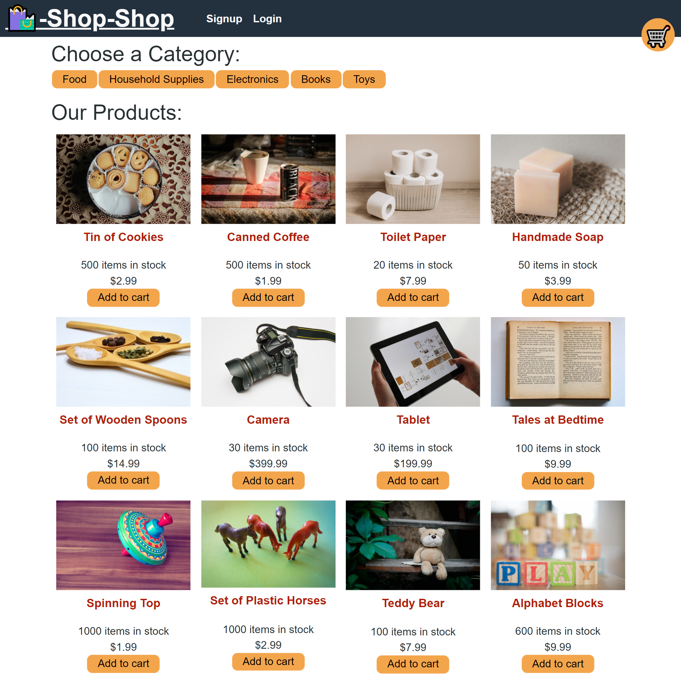

# Redux Store

# Redux Shop


  ## Description
  Acceptance Criteria:

  ```
GIVEN an e-commerce platform that uses Redux to manage global state
WHEN I review the app’s store
THEN I find that the app uses a Redux store instead of the Context API
WHEN I review the way the React front end accesses the store
THEN I find that the app uses a Redux provider
WHEN I review the way the app determines changes to its global state
THEN I find that the app passes reducers to a Redux store instead of using the Context API
WHEN I review the way the app extracts state data from the store
THEN I find that the app uses Redux instead of the Context API
WHEN I review the way the app dispatches actions
THEN I find that the app uses Redux instead of the Context API  
```

  ## Table of Contents
  - [Description](#description)
  - [Installation](#installation)
  - [Usage](#usage)
  - [License](#license)
  - [Credits](#credits)

  ## Installation
  `npm i` 

  ## Usage

  In the project directory, you can run: `npm start` or `npm run develop`

  Runs the app in the development mode.\
  Open [http://localhost:3000](http://localhost:3000) to view it in the browser.

  The page will reload if you make edits.\
  You will also see any lint errors in the console.

  Running `npm run build` builds the app for production to the `build` folder.\
  It correctly bundles React in production mode and optimizes the build for the best performance.

  The build is minified and the filenames include the hashes.\
  Your app is ready to be deployed!

  Below is a screenshot of the [deployed application](https://limitless-castle-02345.herokuapp.com/): 

   

  ## License
  This application is covered by [MIT](https://opensource.org/licenses/MIT) license. 
  
  ## Credits: 
  https://courses.bootcampspot.com/


 